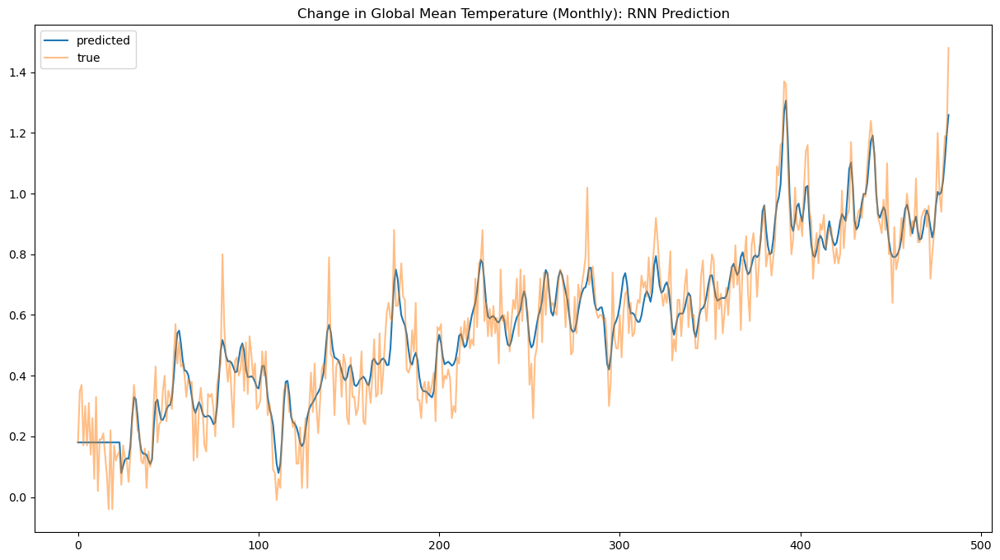
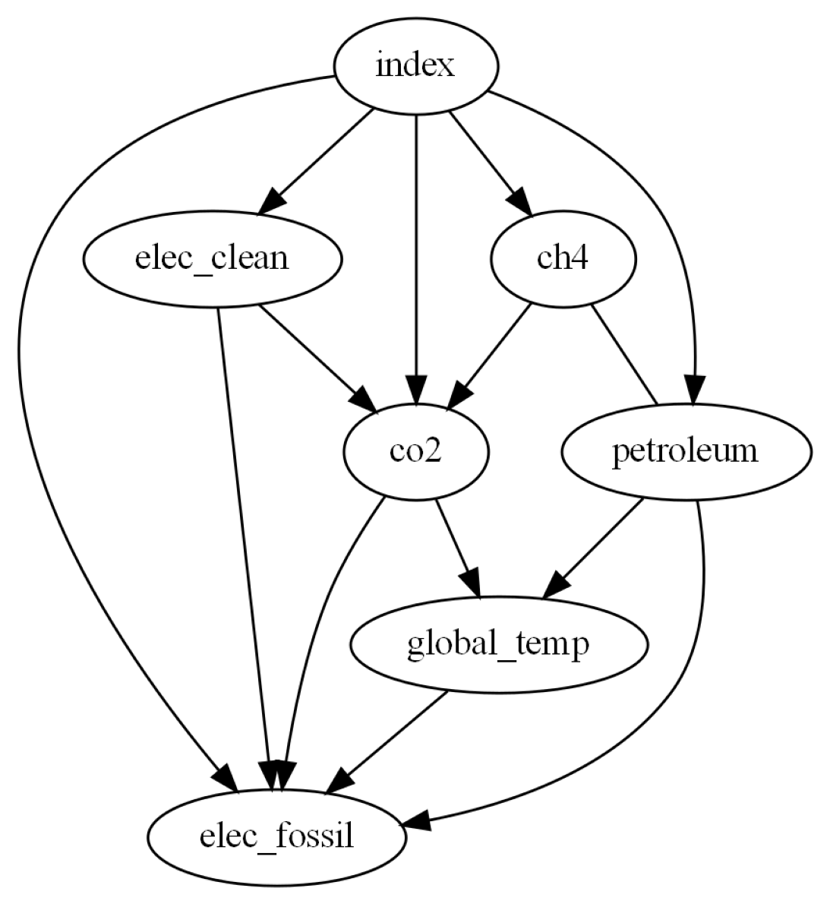

# Causal Analysis of Instantaneous and Time-Delayed Relations in the Earth System

Authors: Keenan Hom, Dean Carrion, Nithilan Muruganandham, Arnav Khanna

Mentors: Biwei Huang, Babak Salimi

---

### Introduction
Climate change is one of the most researched topics in the scientific community. The importance of studying such a topic cannot be understated, as earth system studies help us understand other aspects of science such as extreme weather, air quality, and human health. To better understand the driving forces behind the massive system that is earth is important, not just for planet longevity, but also for human longevity. From previous research, we understand that various human activities are the main contributing factors towards negative climate change. Understanding which of these activities are the most impactful helps us target and stop or slow the systems in place that harm our environment, protecting the earth and its inhabitants.

One way we can establish an understanding of earth system science is through studying which factors are driving forces behind other phenomena. For example, we would want to find out what drives global warming or air quality decreasing, so that we may try to tackle the roots of the problems rather than cure symptoms. One way to understand driving forces is through correlation, however, the caveat is that establishing correlation in no way establishes an undeniable causal link between two factors. Two events can be correlated in trends but unrelated in every other aspect, such as when two variables are caused be a third, unseen variable. This is why we must establish causation instead. Establishing causation is a different, more difficult method that definitively means one variable causes another. This can be done through several causal methods, such as Granger causality and Nonlinear state-space methods.

As mentioned in [this article by Song and Ma](https://www.mdpi.com/2571-905X/6/2/40), and [this article by Runge](https://doi.org/10.1038/s43017-023-00431-y), the current standard for exploring the interactions between climate variables have been large physics-based simulation models, programmed with equations derived from observational data. However, these models demand high computational resources and are out of reach for many people. They also require specific assumptions to be made, which may hinder their reliability. Therefore, as suggested in the article by Runge, we will apply purely data-driven causal models to quantify the relationships between climate variables. Such models would serve as a "double-check" to simulation models, in addition to requiring less computing power.

In our causal analysis, We will focus specifically on human-related activities that are well-known to be causes of climate change. This includes measures of global warming, greenhouse gas emissions, energy production, forestation, crop yields, and transportation usage among other variables. We will use two methods to perform causal inference, Neural Network models and Structural Causal Model Frameworks (SCMs). We chose Neural Network models based on their success when working with time series data and their ability to detect highly nonlinear relationships, which we expect to find in our data. SCMs are a dedicated causal framework that seek to represent variables as nodes in a directed graph. An edge from node *x* to node *y* means that *x* has been determined to cause *y*. SCMs have scarcely been applied in the field of climate change research, so this project will also serve to analyze their effectiveness within the Earth system.

### Data Sources
* Global Temperature: Goddard Institute for Space Studies (GISS) / NASA
* CO2 & Methane (CH4): Global Monitoring Division of the National Oceanic and Atmospheric Administration (NOAA)
* Electricity Generation (Fossil Fuels/Clean) & Petroleum Production: Energy Information Administration (EIA)

### Methods
### Time-Delayed Causal Relations with Neural Network Implementations

### Instantaneous Causal Relations with PC Algorithm and Structural Causal Models

### Combined Time-Delayed and Instantaneous Causal Relations
### Results
### References
#### Contact Info
Keenan Hom: kwhom@ucsd.edu
 
Dean Carrion: dcarrion@ucsd.edu
 
Nithilan Muruganandham: nmuruganandham@ucsd.edu
 
Arnav Khanna: arkhanna@ucsd.edu
 
Biwei Huang: bih007@ucsd.edu
 
Babak Salimi: bsalimi@ucsd.edu
