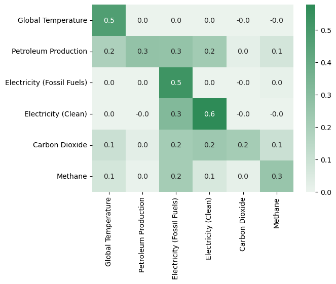
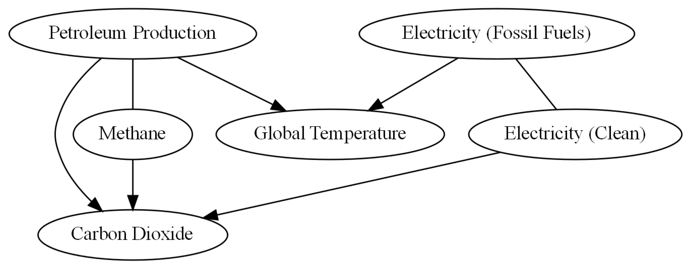

Authors: Keenan Hom, Dean Carrion, Nithilan Muruganandham, Arnav Khanna

Mentors: Biwei Huang, Babak Salimi

---

### Introduction
Climate change is one of the most researched topics in the scientific community. The importance of studying such a topic cannot be understated, as earth system studies help us understand other aspects of science such as extreme weather, air quality, and human health. To better understand the driving features behind the massive system of "Earth" is important, not just for planet longevity, but also for human longevity. From previous research, we understand that various human activities are the main contributing factors towards negative climate change like global warming and rising sea levels. Understanding which of these activities are the most impactful helps us target and stop or slow the systems in place that harm our environment.

One way we can establish an understanding of earth system science is through studying which factors are driving forces behind other phenomena. For example, we would want to find out what drives global warming or air quality decreasing, so that we may try to tackle the roots of the problems rather than cure symptoms. One way to understand driving forces is through correlation, however, the caveat is that establishing correlation in no way establishes an undeniable causal link between two factors. Two events can be correlated in trends but unrelated in every other aspect, such as when two variables are caused be a third, unseen variable. This is why we must establish causation instead. Establishing causation is a different, more difficult method that directly supports the idea that one variable causes another. This can be done through several causal methods, such as Granger causality and Nonlinear state-space methods.

As mentioned in [this article by Song and Ma](https://www.mdpi.com/2571-905X/6/2/40), and [this article by Runge](https://doi.org/10.1038/s43017-023-00431-y), the current standard for exploring the interactions between climate variables have been large physics-based simulation models, programmed with equations derived from observational data. However, these models demand high computational resources and are out of reach for many people. Therefore we will apply purely data-driven causal models to quantify the relationships between climate variables. Such models would serve as a "double-check" to simulation models, in addition to requiring less computing power.

In our causal analysis, We will focus specifically on human-related activities that are well-known to be causes of climate change. This includes measures of global warming, greenhouse gas emissions, energy production, and petroleum production. We will use two methods to perform causal inference, Neural Network models and Structural Causal Model Frameworks (SCMs). We chose Neural Network models based on their success when working with time series data and their ability to detect highly nonlinear relationships, which we expect to find in our data. SCMs are a dedicated causal framework that seek to represent variables as nodes in a directed graph. An edge from node *x* to node *y* means that *x* has been determined to cause *y*. SCMs have scarcely been applied in the field of climate change research, so this project will also serve to analyze their effectiveness within the Earth system.

### Data

  
Global Temperature: Goddard Institute for Space Studies (GISS) / NASA

   
  https://data.giss.nasa.gov/gistemp/

  
CO2 & Methane (CH4): Global Monitoring Division of the National Oceanic and Atmospheric Administration (NOAA)

   
  * https://gml.noaa.gov/ccgg/trends/gl_data.html
  * https://gml.noaa.gov/ccgg/trends_ch4/

  
Electricity Generation (Fossil Fuels/Clean) & Petroleum Production: Energy Information Administration (EIA)

   
  * https://www.eia.gov/totalenergy/data/monthly/
  * https://www.eia.gov/international/data/world

### Methods

We are using two different models to detect time-lagged (long-term effect) and instantaneous (short-term effect) causal relationships in the data. Then, a combined version that uses implementations of both models to detect both instantaneous and time-lagged relationships together.

  
Time-Delayed Causal Relations with Neural Network Implementations

   
  With the assistance of the python package PyTorch, we trained several artificial neural network models on a large portion of the dataset, leaving some recent data as a validation set. This consisted of optimizing the number of layers in our Recurrent Neural Network and the ideal lag value. This model is used to determine Granger causality between variables. We determine causality by systematically leaving out one variable from the training data, training the model, and checking if the error is higher than that of a model trained on the full dataset. We retrain the same model many times to reduce the influence of randomness, and perform a t-test on the resulting errors. Additionally, we will use a NN (trained on the full dataset) to get the residuals when predicting for each variable; these residuals are later used in SCMs.

 

  
Instantaneous Causal Relations with CD-NOD Algorithm and Structural Causal Models

   
  Using the causallearn python package, the entire dataset was run through a CD-NOD algorithm to find instantaneous causal relations between each variable. This can then be visualized through a node graph. Using the causal links found from the CD-NOD algorithm, an additive noise model (ANM) was applied to each causal link to discover the direction of the link between each node. The ANM returns probabilities of causal direction between each given variable, and thus an threshold of 0.05 will be used to determine enough probable cause for a causal relation. The detection of instantaneous relations is important, since our data has been averaged on a monthly basis. One month is more than enough time for our climate variables to affect one another, but this change would appear to be instantaneous in our data.

 

  
Combined Time-Delayed and Instantaneous Causal Relations

   
  We are also able to combine NNs and SCMs to create a model that can detect both time-lagged and instantaneous causal relations. First, we fit a NN to the full dataset, which will attempt to predict one time step into the future using a specified number of lags. Then, we find the residuals between the predicted and actual data, and plug this in as input to an SCM. The SCM, in determining causal relations between residuals, will be able to find the instantaneous causal relations that our time-lagged model misses.

<ins><h2>Results</h2></ins>

### Time-Delayed Causal Relations with Neural Network Implementations

<h4>Prediction Performance of the Neural Network model for each Feature</h4>

<h4>Heatmap of Granger Causality Importance</h4>

The direction of causality is denoted as (row -> column). For example:
the value of Importance of Petroleum Production for predicting Electricity (Fossil Fuels) is 0.3.

### Instantaneous Causal Relations with CD-NOD Algorithm and Structural Causal Models

<h4>Node-Link Diagram of Causal Relations using CD-NOD Algorithm</h4>

Using an additive noise model to analyze the direction between Methane and Petroleum Production, we found the causal direction goes both ways: (Methane -> Petroleum Production) & (Petroleum Production -> Methane)

### Combined Time-Delayed and Instantaneous Causal Relations

<h4>Node-Link Diagram of Causal Relations using CD-NOD Algorithm on NN Residuals</h4>

Using an additive noise model to analyze the direction between Methane and Petroleum Production, we found the causal direction goes both ways: (Methane -> Petroleum Production) & (Petroleum Production -> Methane)

Using an additive noise model to analyze the direction between Electricity (Fossil Fuels) and Electricity (Clean), we found the causal direction goes both ways: (Electricity (Fossil Fuels) -> Electricity (Clean)) & (Electricity (Clean) -> Electricity (Fossil Fuels))

### Findings
As you can see, there are a lot of causal relations connecting each feature within the earth system. From our results, many of the causal directions make sense from previous knowledge, like Petroleum Production being an important factor in Global Temperature change. We can see particularly strong relations with relations that are consistent from model to model. However, some relationships are completely different between each method, such as Electricity (Fossil Fuels) and Global Temperature having three different causal relations: No relation (Time-Lagged), Global Temperature causing Fossil Fuel Electricity (Instantaneous), and Fossil Fuel Electricity causing Global Temperature (Combined). 

#### For more information:
Please refer to our research <a href="TEST_REPORT.pdf">report</a>

### References
(EIA), U.S. Energy Information Administration’s., “The Monthly Energy Review.” [Link](https://www.eia.gov/totalenergy/data/monthly/)

EPA., “Sources of Greenhouse Gas Emissions.” [Link](https://www.epa.gov/ghgemissions/sources-greenhouse-gas-emissions#:~:text=Carbon%20dioxide%20(CO2)%20makes,natural%20gas%2C%20to%20produce%20electricity.)

GISTEMP-Team. 2024. “GISS Surface Temperature Analysis (GISTEMP).” NASA Goddard
Institute for Space Studies. [Link](https://data.giss.nasa.gov/gistemp/)

Runge, Jakob, Andreas Gerhardus, Gherardo Varando, Veronika Eyring, and Gustau
Camps-Valls. 2023. “Causal inference for time series.” Nature Reviews Earth & Environ-
ment 4(7): 487–505. [Link](https://www.nature.com/articles/s43017-023-00431-y)

Song, Jiecheng, and Merry Ma. 2023. “Climate Change: Linear and Nonlinear Causality
Analysis.” Stats 6(2): 626–642. [Link](https://www.mdpi.com/2571-905X/6/2/40)

X. Lan, K.W. Thoning, and E.J. Dlugokencky., “Trends in globally-averaged CH4, N2O,
and SF6 determined from NOAA Global Monitoring Laboratory measurements.” [Link](https://gml.noaa.gov/ccgg/trends_doi.html)

X. Lan, P. Tans, and K.W. Thoning., “Trends in globally-averaged CO2 determined from
NOAA Global Monitoring Laboratory measurements.” [Link](https://gml.noaa.gov/ccgg/trends/global.html?doi=10.15138/9n0h-zh07)

#### Contact Info
* Keenan Hom: kwhom@ucsd.edu
* Dean Carrion: dcarrion@ucsd.edu
* Nithilan Muruganandham: nmuruganandham@ucsd.edu
* Arnav Khanna: arkhanna@ucsd.edu
* Biwei Huang: bih007@ucsd.edu
* Babak Salimi: bsalimi@ucsd.edu
